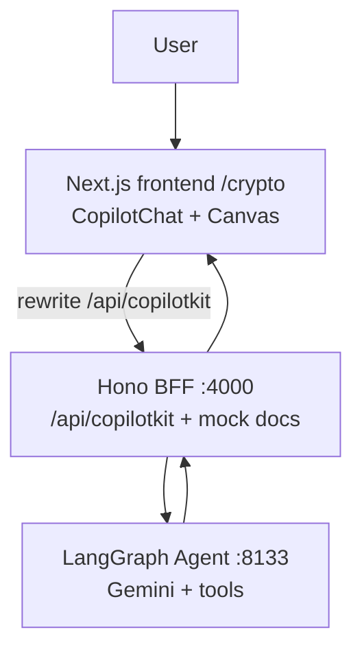

# Architecture

## Runtime flow

1. User sends prompt in `CopilotChat`.
2. Frontend hits `/api/copilotkit` (rewritten to BFF).
3. BFF forwards run to LangGraph agent.
4. Agent executes one crypto backend tool.
5. Tool returns `Command(update=...)` with `cryptoBrief` and `cryptoProcess`.
6. CopilotKit streams events/state back to frontend.
7. Chat companion and canvas render from shared state.

## Data sources

- Market/project/signal/event data: in-repo mock dataset (`apps/agent/src/crypto_tools.py`)
- Token research docs: BFF mock endpoint (`/api/mock/token-docs/:symbol`)
